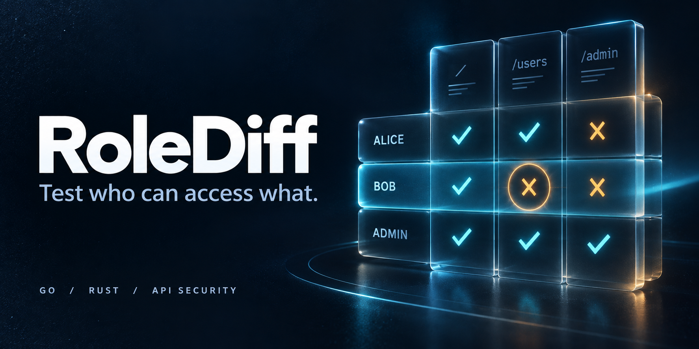

# RoleDiff

**Authorization regression tests for APIs, in Go and Rust.**

Does Bob have access to Alice's order? Can an ordinary account reach an admin endpoint? Define the expected access for each test identity, run the same requests, and compare status codes and JSON assertions. Repeat the suite after a fix or run it in CI.

Native Go and Rust libraries and CLIs · MIT · One shared suite/report format

```text
     [ alice ] --+        R O L E D I F F
     [  bob  ] --+--> ?   Test who can access what.
     [ admin ] --+
     [ guest ] --+        Authorization regression tests
```

## Install

Go 1.23+ (standard library only):

```sh
go install github.com/dc9-dev/rolediff/cmd/rolediff@latest
```

From this checkout:

```sh
go build -o bin/rolediff ./cmd/rolediff
```

Rust 1.85.1+ (native implementation using reqwest/rustls and serde):

```sh
cd rust
cargo build --release --locked
./target/release/rolediff -h
```

The `rust/` directory is a standalone Cargo package with a pinned toolchain and lockfile. It does not invoke or link to the Go binary. Both executables are named `rolediff`; choose one or keep their paths distinct. See the [Rust package guide](rust/README.md).

## Try the included demonstration

Start the fictional API on loopback (Python 3.10+):

```sh
python3 examples/demo_server.py --vulnerable
```

In another terminal, from the repository root:

```sh
export ROLEDIFF_ALICE_TOKEN=demo-alice
export ROLEDIFF_BOB_TOKEN=demo-bob
export ROLEDIFF_ADMIN_TOKEN=demo-admin

./bin/rolediff -delay-ms 0 testdata/suite.json
# Or use the same suite with Rust:
./rust/target/release/rolediff -delay-ms 0 testdata/suite.json
```

The vulnerable service lets Bob read Alice's order. RoleDiff reports an unexpected status and a protected field that should have been absent, then exits 1. Restart the demo without `--vulnerable` and the eight checks pass.

All demonstration credentials and data are fictional. Nothing is fetched outside the explicitly configured origin, and redirects are not followed.

## Suite format

A suite contains one origin, named identities, and named cases. Every case must specify an expectation for every identity, so an omitted account cannot silently disappear from the matrix.

```json
{
  "base_url": "https://staging.example.test",
  "identities": [
    {"name": "alice", "bearer_env": "ALICE_TOKEN"},
    {"name": "bob", "bearer_env": "BOB_TOKEN"}
  ],
  "cases": [{
    "name": "alice-order",
    "method": "GET",
    "path": "/api/orders/alice-1",
    "expect": {
      "alice": {
        "access": "allow",
        "status": [200],
        "json": [{"pointer": "/id", "op": "equals", "value": "alice-1"}]
      },
      "bob": {
        "access": "deny",
        "status": [403, 404],
        "json": [{"pointer": "/id", "op": "absent"}]
      }
    }
  }]
}
```

- `base_url` is an HTTP(S) origin with no credentials, query, fragment or path prefix. Put complete paths in each case.
- Identity/case names use 1–64 ASCII letters, digits, underscores, dots or hyphens, beginning with a letter or digit.
- `bearer_env` reads the token from the named environment variable and adds `Bearer `. For cookie or API-key authentication, use `"header_env": {"Cookie": "SESSION_COOKIE", "X-Api-Key": "API_KEY"}`. Header values are read verbatim from those variables; credentials are never embedded in suite fields.
- `method` defaults to `GET`; `HEAD` is also supported. Paths must begin with a single `/`; cross-origin references, fragments, backslashes and dot segments are rejected.
- `access` labels the intended policy (`allow` or `deny`). The explicitly configured statuses and assertions determine success; RoleDiff does not infer the application's policy.
- A GET `allow` expectation, or one accepting a 2xx response, requires at least one positive `equals`/`exists` assertion. This prevents a bare `200` login page from passing. Choose a field that actually proves the intended response.
- HEAD is status-only. It cannot prove body-level access and does not accept JSON assertions.
- Unknown fields, duplicate JSON keys and incomplete identity matrices are rejected before network activity.

## JSON assertions

Pointers follow the string form of [RFC 6901](https://www.rfc-editor.org/rfc/rfc6901.html): `/orders/0/id`, `~1` for a slash in a key, `~0` for a tilde, and an empty pointer for the whole document. Array indices cannot have leading zeros.

| Operator | Pass condition |
| --- | --- |
| `equals` | Field exists and equals `value` |
| `not_equals` | Field exists and differs from `value`; missing is a failure |
| `exists` | Field exists, even when its value is `null` |
| `absent` | Pointer does not resolve to a field |

`equals`/`not_equals` require a `value`, including explicit `null`. `exists`/`absent` forbid it. Objects and arrays are compared structurally; decimal numbers are compared exactly without float64 rounding (`1` equals `1.0`). JSON nesting is limited to 64 levels and number tokens to 1024 characters. Invalid or ambiguous response JSON fails a JSON expectation.

## CLI and CI

```sh
rolediff -validate testdata/suite.json
rolediff -json -timeout-ms 5000 -delay-ms 100 suite.json > report.json
cat suite.json | rolediff -json
```

Flags precede the optional file. No file, or `-`, reads stdin. Starting in a terminal without arguments displays ASCII art and help. Machine-readable stdout contains no banner.

`-validate` checks the suite, request budget and credential environment without sending requests. It emits JSON with the planned request count.

| Flag | Default | Limit |
| --- | --- | --- |
| `-timeout-ms` | 5000 | 1–300000 ms per request |
| `-delay-ms` | 100 | 0–60000 ms between requests |
| `-max-requests` | 256 | 1–10000 planned requests |
| `-max-response-bytes` | 1048576 | 1 byte–64 MiB |

Suites are limited to 1 MiB, 64 identities, 1000 cases and 64 assertions per expectation. An over-budget suite is refused in full.

| Exit | Meaning |
| --- | --- |
| `0` | All checks passed, or validation completed |
| `1` | At least one assertion failed |
| `2` | Invalid configuration, missing credential, transport error, redirect, size limit or incomplete run |

Reports list the case, identity, expected access, outcome, HTTP status and failed assertion index. They omit URLs, tokens, raw bodies, headers and expected JSON values. Names come from your suite and must not contain secrets. Errors also avoid echoing response content or transport diagnostics.

## Libraries

Go:

```go
suite, err := rolediff.ReadSuite(reader)
if err != nil { return err }
runner, err := rolediff.NewRunner(suite, rolediff.Options{})
if err != nil { return err }
report := runner.Run(ctx)
```

Import `github.com/dc9-dev/rolediff`. Use `Options.LookupEnv` for an application-owned credential resolver. `Run` respects context cancellation and skips queued requests.

Rust:

```rust
use rolediff::{Options, Runner, Suite};

let suite = Suite::read(reader)?;
let runner = Runner::new(suite, Options::default())?;
let report = runner.run();
```

The Rust API is blocking. `Runner::with_env` accepts a credential resolver; `run_with_cancel` accepts an atomic cancellation flag. An in-flight Rust request remains bounded by its timeout. The standalone Rust CLI uses the operating system's default interrupt behavior; Go emits a partial report on interrupt.

## Scope

Use reviewed suites against systems you are authorized to test. GET/HEAD can still have side effects in an application that implements them incorrectly. RoleDiff runs sequentially and does not discover endpoints, guess object IDs, mutate requests or decide which role should have access.

The HTTP clients validate TLS certificates, ignore automatic proxy configuration, do not follow redirects and do not retain response cookies. Cookie-based tests use only the explicit per-identity credentials. A clean result covers the configured assertions, not all possible authorization flaws. Weak expectations can still miss problems.

This workflow targets regression checks related to [OWASP object-level authorization](https://api-security.owasp.org/editions/2023/en/0xa1-broken-object-level-authorization/) and [function-level authorization](https://api-security.owasp.org/editions/2023/en/0xa5-broken-function-level-authorization/).

## Development

```sh
go test -race -cover ./...
go vet ./...
go build -o bin/rolediff ./cmd/rolediff
cd rust
cargo test --locked
cargo clippy --locked --all-targets -- -D warnings
cargo build --locked
cd ..
python3 scripts/test_parity.py
```

The parity suite starts a loopback-only mock API and runs both native binaries against the same scenarios, comparing reports and exit codes. It includes a deliberate authorization regression, identity isolation, login-page responses, malformed JSON, numeric precision, redirects, missing credentials and resource limits.

[Contributing](CONTRIBUTING.md) · [Security](SECURITY.md) · [GitHub description](docs/github.md) · [MIT license](LICENSE)

The banner was generated with an AI image tool; its [prompt and provenance](docs/assets/README.md) are included.
